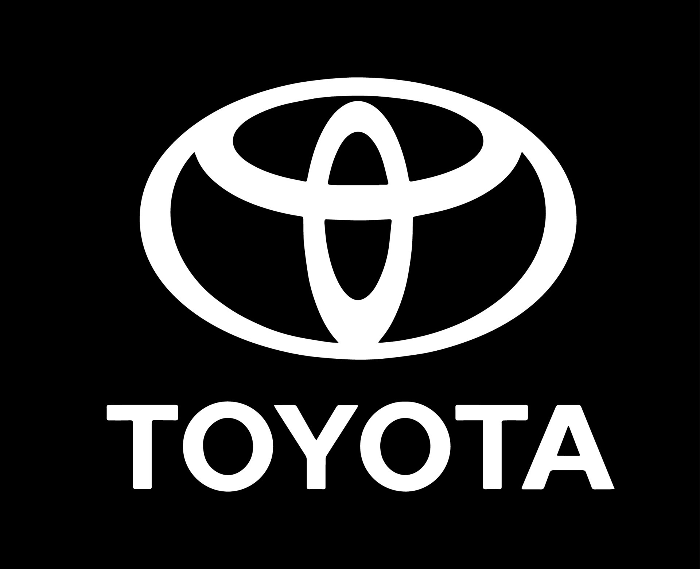

# Études de Cas : Entreprises Axées sur la Qualité

## Introduction

Les études de cas offrent des aperçus précieux sur la manière dont les entreprises mettent en œuvre la qualité comme élément clé de leur stratégie à long terme. En examinant des entreprises reconnues pour leur excellence en matière de qualité, nous pouvons identifier les pratiques, les stratégies et les résultats qui ont contribué à leur succès. Ce document présente une analyse approfondie de plusieurs entreprises qui ont intégré la qualité dans leur stratégie pour obtenir un avantage concurrentiel et réussir sur le long terme.

## 1. Étude de Cas : Toyota

  
  

### 1.1 Contexte de l'Entreprise

Toyota, fondée en 1937 au Japon, est l'un des plus grands fabricants d'automobiles au monde. L'entreprise est célèbre pour son Toyota Production System (TPS), qui est un modèle de gestion de la production axé sur la qualité et l'efficacité.

### 1.2 Stratégie de Qualité

- **Lean Manufacturing :** Toyota a développé le système lean pour éliminer les déchets, améliorer l'efficacité et augmenter la flexibilité. Ce système repose sur des principes tels que la production juste-à-temps (JIT) et la gestion des flux de travail.
  
- **Kaizen (Amélioration Continue) :** Le concept de Kaizen est au cœur du TPS, encourageant une amélioration continue à tous les niveaux de l'organisation. Les employés sont impliqués dans le processus d'amélioration pour optimiser les processus et réduire les défauts.

- **Qualité Totale :** Chaque employé, de la production au management, est responsable de la qualité. Cela inclut la détection et la résolution des problèmes immédiatement sur le lieu de travail.

### 1.3 Résultats et Impact

- **Réduction des Coûts :** Grâce à l'élimination des déchets et à l'amélioration des processus, Toyota a réduit ses coûts de production et a maintenu des marges bénéficiaires élevées.
  
- **Amélioration Continue :** Le Kaizen a permis à Toyota de constamment améliorer ses processus, réduisant les défauts et augmentant la satisfaction des clients.

- **Avantage Concurrentiel :** Le modèle de production lean a permis à Toyota de se distinguer par ses véhicules fiables et de haute qualité, renforçant sa position sur le marché mondial.

## 2. Étude de Cas : Apple

  
  

### 2.1 Contexte de l'Entreprise

Apple Inc., fondée en 1976, est un leader mondial dans le secteur de la technologie, particulièrement reconnue pour ses produits innovants tels que l'iPhone, l'iPad et les MacBooks. L'entreprise est célèbre pour son engagement envers le design et la qualité.

### 2.2 Stratégie de Qualité

- **Innovation et Design :** Apple se concentre sur l'innovation en design pour créer des produits qui offrent une expérience utilisateur exceptionnelle. L'entreprise investit dans la recherche et le développement pour introduire des technologies de pointe et des designs élégants.

- **Contrôle de Qualité Rigoureux :** Apple applique des normes de qualité strictes tout au long de la chaîne de production. Chaque produit est soumis à des tests rigoureux pour garantir qu'il répond aux exigences élevées de l'entreprise.

- **Gestion de la Chaîne d'Approvisionnement :** Apple gère de près sa chaîne d'approvisionnement pour garantir que les composants sont de haute qualité et que la production est conforme aux normes de l'entreprise.

### 2.3 Résultats et Impact

- **Fidélité des Clients :** L'accent mis sur la qualité et le design a permis à Apple de construire une base de clients fidèles et enthousiastes.

- **Avantage Technologique :** L'innovation continue a permis à Apple de maintenir un avantage technologique sur ses concurrents et de rester à la pointe du marché technologique.

- **Performance Financière :** La stratégie axée sur la qualité a contribué à des marges bénéficiaires élevées et à une performance financière exceptionnelle, renforçant la position d'Apple en tant que leader de l'industrie.

## 3. Étude de Cas : Starbucks

  
  

### 3.1 Contexte de l'Entreprise

Starbucks, fondée en 1971, est une chaîne mondiale de cafés qui se distingue par son engagement envers la qualité des produits et l'expérience client.

### 3.2 Stratégie de Qualité

- **Expérience Client :** Starbucks se concentre sur la création d'une expérience client unique, avec une ambiance accueillante, un service personnalisé et des produits de haute qualité. L'entreprise investit dans la formation de ses employés pour garantir un service client exceptionnel.

- **Approvisionnement Durable :** Starbucks s'engage à utiliser des pratiques d'approvisionnement durable pour garantir que les grains de café sont de haute qualité et issus de sources responsables. L'entreprise soutient des initiatives telles que le Fair Trade et l'agriculture durable.

- **Innovation dans le Menu :** Starbucks innove régulièrement son menu pour inclure de nouveaux produits et répondre aux préférences des clients. Cela inclut des options saisonnières et des produits personnalisés.

### 3.3 Résultats et Impact

- **Fidélisation des Clients :** La qualité constante de l'expérience client et des produits a conduit à une forte fidélisation et à une croissance continue de la clientèle.

- **Image de Marque :** Starbucks est perçu comme une marque premium avec une forte orientation vers la responsabilité sociale et la qualité, renforçant son image auprès des consommateurs.

- **Croissance :** L'accent mis sur la qualité et l'innovation a soutenu une expansion rapide et réussie dans les marchés internationaux.

## 4. Étude de Cas : Amazon

  
  

### 4.1 Contexte de l'Entreprise

Amazon, fondée en 1994, est une entreprise mondiale de commerce en ligne et de technologie, reconnue pour ses pratiques innovantes et son engagement envers la qualité du service.

### 4.2 Stratégie de Qualité

- **Service Client Exceptionnel :** Amazon place le service client au cœur de sa stratégie, offrant des options de livraison rapide, une politique de retour flexible et un support client accessible.

- **Technologie et Innovation :** Amazon investit massivement dans la technologie pour optimiser ses opérations, améliorer l'efficacité et offrir une expérience utilisateur fluide. L'entreprise utilise des algorithmes sophistiqués pour personnaliser les recommandations et améliorer la gestion des stocks.

- **Logistique Avancée :** La stratégie logistique d'Amazon comprend des centres de distribution automatisés et des solutions de livraison innovantes pour garantir une livraison rapide et fiable.

### 4.3 Résultats et Impact

- **Satisfaction Client :** Amazon est souvent classé parmi les entreprises les mieux notées pour la satisfaction client grâce à son engagement envers des services de haute qualité.

- **Leadership sur le Marché :** La combinaison de la qualité du service et de l'innovation technologique a permis à Amazon de dominer le marché du commerce en ligne et de diversifier ses activités dans des secteurs tels que le cloud computing et les médias.

- **Performance Financière :** La stratégie axée sur la qualité a contribué à une croissance rapide des revenus et à une expansion continue dans de nouveaux marchés.

## Conclusion

L'analyse de ces études de cas montre que l'intégration de la qualité dans la stratégie à long terme est un facteur clé de succès pour les entreprises. En mettant l'accent sur la qualité, des entreprises telles que Toyota, Apple, Starbucks et Amazon ont pu renforcer leur position sur le marché, améliorer leur performance et atteindre leurs objectifs stratégiques. Ces exemples illustrent comment une stratégie axée sur la qualité peut conduire à des avantages concurrentiels durables et à une réussite exceptionnelle sur le long terme.

