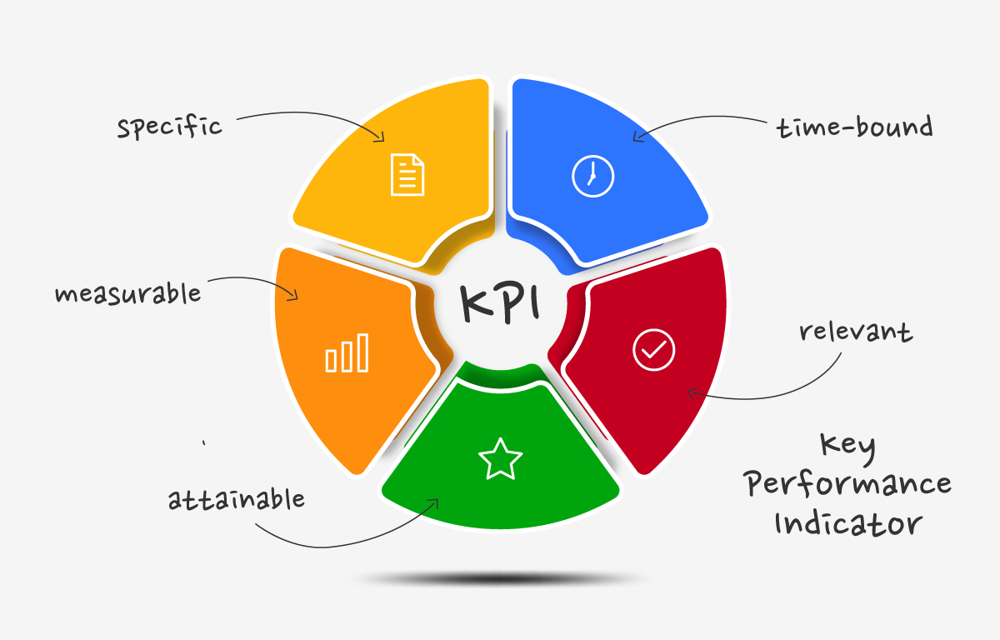
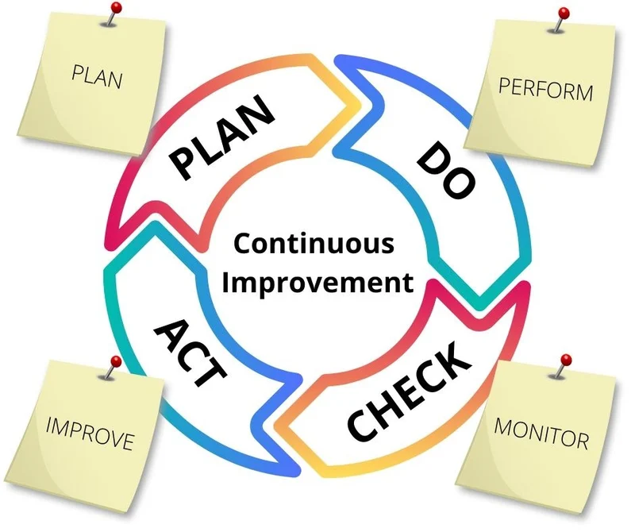

# Mesure de la Performance Qualitative

## Introduction

La mesure de la performance qualitative est cruciale pour évaluer l'efficacité des processus liés à la qualité au sein d'une organisation. En établissant des indicateurs clés de performance (KPI), en surveillant les résultats et en engageant un processus d'amélioration continue, les entreprises peuvent assurer une gestion efficace de la qualité et optimiser leurs performances à long terme. Ce guide explore en profondeur les KPI liés à la qualité, les méthodes de suivi et les techniques d'amélioration continue.

## 1. Indicateurs Clés de Performance (KPI) Liés à la Qualité

  
  

Les KPI liés à la qualité permettent de quantifier et d’évaluer divers aspects de la performance en matière de qualité. Ils fournissent des informations essentielles pour la gestion et l’amélioration des processus.

### 1.1 Types de KPI Liés à la Qualité

- **Taux de Défaillance :**
  
  - **Définition :** Le taux de défaillance est le pourcentage de produits ou services présentant des défauts par rapport au total des unités produites ou fournies.
  - **Calcul :** 
    Taux de Défaillance = (Nombre de Produits Défectueux / Nombre Total de Produits) × 100
  - **Utilisation :** Un taux de défaillance élevé peut indiquer des problèmes dans le processus de production ou de service. Une analyse approfondie permet de comprendre les causes et de mettre en place des actions correctives.

- **Coût de la Non-Qualité :**
  
  - **Définition :** Le coût de la non-qualité comprend tous les coûts associés aux défauts, y compris les coûts de retour, les réparations et les pertes de productivité.
  - **Composants :** 
  
    - Coûts de rejet
    - Coûts de correction
    - Coûts de garantie
    - Coûts de retour des produits
  - **Calcul :** 
    Coût de la Non-Qualité = Coût des Réclamations + Coût des Rejets + Coût des Réparations
  - **Utilisation :** Ce KPI aide à quantifier l'impact financier des problèmes de qualité et à identifier les opportunités d'amélioration pour réduire ces coûts.

- **Satisfaction Client :**
  
  - **Définition :** La satisfaction client mesure la perception de la qualité par les clients, généralement collectée par le biais d’enquêtes et de retours.
  - **Méthodes de Mesure :** 
    - Enquêtes de satisfaction
    - Net Promoter Score (NPS)
    - Avis et commentaires en ligne
  - **Calcul :** 
    Satisfaction Client = (Nombre de Réponses Positives / Nombre Total de Réponses) × 100
  - **Utilisation :** Une haute satisfaction client indique généralement que les produits ou services répondent aux attentes des clients. Des scores bas peuvent signaler des domaines nécessitant des améliorations.

- **Taux de Rejets :**
  
  - **Définition :** Le taux de rejets mesure le pourcentage de produits rejetés lors du contrôle qualité.
  - **Calcul :** 
    Taux de Rejets = (Nombre de Produits Rejetés / Nombre Total de Produits Inspectés) × 100
  - **Utilisation :** Un taux de rejets élevé peut indiquer des problèmes avec le processus de fabrication ou des matériaux utilisés. Il est essentiel de surveiller ce KPI pour assurer la qualité des produits finis.

- **Délai de Réponse aux Réclamations :**
  
  - **Définition :** Ce KPI mesure le temps moyen nécessaire pour répondre et résoudre les réclamations des clients.
  - **Calcul :** 
    Délai de Réponse = Temps Total de Réponse / Nombre Total de Réclamations
  - **Utilisation :** Un délai de réponse court améliore la satisfaction client et montre que l’entreprise est réactive face aux problèmes. Des délais longs peuvent entraîner une insatisfaction client et une perte de confiance.

- **Indice de Performance des Fournisseurs :**
  
  - **Définition :** Ce KPI évalue la qualité des matériaux fournis en fonction des critères définis, comme le taux de non-conformité.
  - **Calcul :** 
    Indice de Performance = (Nombre de Non-Conformités / Nombre Total de Matériaux Livrés) × 100
  - **Utilisation :** Un indice faible peut indiquer des problèmes avec les fournisseurs. Une gestion rigoureuse de la performance des fournisseurs est essentielle pour maintenir la qualité des produits finaux.

### 1.2 Mise en Œuvre des KPI

- **Définition des Objectifs :**
  
  - **Identification des Objectifs :** Déterminer des objectifs spécifiques et mesurables pour chaque KPI en fonction des priorités stratégiques de l'entreprise.
  - **Alignement :** S’assurer que les objectifs des KPI sont alignés avec les objectifs globaux de qualité de l'entreprise et les attentes des parties prenantes.

- **Collecte des Données :**
  
  - **Systèmes de Collecte :** Mettre en place des systèmes pour recueillir des données précises, telles que des logiciels de gestion de la qualité, des outils de mesure automatisés, et des enquêtes clients.
  - **Validation des Données :** Assurer la fiabilité et la validité des données collectées pour obtenir des résultats significatifs.

- **Analyse des Résultats :**
  
  - **Outils d'Analyse :** Utiliser des outils statistiques et d'analyse des données pour interpréter les résultats des KPI. Cela peut inclure des graphiques, des tableaux croisés dynamiques et des analyses de tendances.
  - **Identification des Tendances :** Analyser les données pour identifier les tendances et les anomalies qui peuvent nécessiter des actions correctives ou des améliorations.

## 2. Suivi de la Performance

### 2.1 Méthodes de Suivi

- **Tableaux de Bord :**
  
  - **Définition :** Les tableaux de bord sont des outils visuels qui affichent les KPI en temps réel à l'aide de graphiques, de tableaux et d’indicateurs clés.
  - **Utilisation :** Permettent aux gestionnaires de suivre la performance en continu et de prendre des décisions basées sur des données actualisées.

- **Rapports Réguliers :**
  
  - **Fréquence :** Générer des rapports périodiques (hebdomadaires, mensuels, trimestriels) pour évaluer la performance et comparer les résultats avec les objectifs fixés.
  - **Contenu :** Inclure des analyses des KPI, des tendances observées, et des recommandations pour les actions à entreprendre.

- **Audits de Qualité :**
  
  - **Définition :** Les audits de qualité sont des évaluations systématiques des processus et des pratiques de qualité pour assurer la conformité aux normes.
  - **Fréquence :** Réaliser des audits réguliers (internes ou externes) pour détecter les écarts par rapport aux normes de qualité et identifier les opportunités d'amélioration.

### 2.2 Actions Correctives

- **Identification des Problèmes :**
  
  - **Analyse des Écarts :** Utiliser les données des KPI pour identifier les écarts par rapport aux objectifs de qualité. Cela peut inclure des problèmes récurrents ou des performances inférieures aux attentes.

- **Développement de Plans d’Action :**
  
  - **Elaboration des Plans :** Développer des plans d’action détaillés pour corriger les problèmes identifiés. Cela peut inclure des modifications des processus, des formations supplémentaires, ou des améliorations des systèmes de contrôle qualité.
  - **Responsabilisation :** Assigner des responsabilités pour la mise en œuvre des plans d'action et fixer des échéances pour les actions correctives.

- **Suivi des Actions :**
  
  - **Évaluation de l'Efficacité :** Assurer le suivi des actions correctives pour évaluer leur efficacité et déterminer si les problèmes ont été résolus.
  - **Ajustements :** Apporter des ajustements aux plans d'action si nécessaire, en fonction des résultats obtenus et des feedbacks reçus.

## 3. Amélioration Continue

### 3.1 Principes de l'Amélioration Continue

- **Kaizen :**

  
  

  
  - **Définition :** Kaizen est un concept japonais signifiant « amélioration continue » qui implique des améliorations constantes et progressives dans tous les aspects de l’organisation.
  - **Application :** Encourager les employés à proposer des idées d’amélioration, mettre en œuvre des changements à petite échelle, et intégrer ces améliorations dans les processus quotidiens.

- **Cycle PDCA (Plan-Do-Check-Act) :**

  
  

  
  - **Plan :** Planifier les améliorations en identifiant les problèmes et en définissant les objectifs d'amélioration.
  - **Do :** Mettre en œuvre les améliorations à petite échelle ou en mode pilote.
  - **Check :** Vérifier les résultats obtenus par rapport aux objectifs fixés et évaluer l’efficacité des changements.
  - **Act :** Ajuster les processus en fonction des résultats et standardiser les changements réussis.

### 3.2 Techniques d'Amélioration

- **Analyse des Causes Racines :**
  
  - **Définition :** L’analyse des causes racines est une méthode utilisée pour identifier les causes fondamentales des problèmes de qualité.
  - **Outils :** Diagramme d'Ishikawa, 5 Pourquoi, Analyse Pareto.

- **Lean Manufacturing :**
  
  - **Définition :** Lean Manufacturing est une approche systématique visant à éliminer les gaspillages dans les processus de production tout en maximisant la valeur pour le client.
  - **Techniques :** Juste-à-temps, Flux Tiré, Kanban.

- **Six Sigma :**
  
  - **Définition :** Six Sigma est une méthode de gestion de la qualité qui vise à réduire la variabilité et les défauts dans les processus à l’aide d’outils statistiques.
  - **Étapes :** DMAIC (Définir, Mesurer, Analyser, Innover, Contrôler).

## Conclusion

Les ***KPI*** liés à la qualité, le suivi de la performance et l'amélioration continue sont des éléments essentiels pour assurer une gestion efficace de la qualité dans toute organisation. Une mise en œuvre rigoureuse de ces principes permet non seulement de réduire les coûts et d'améliorer la satisfaction des clients, mais aussi d'assurer une croissance durable et un avantage concurrentiel à long terme.
