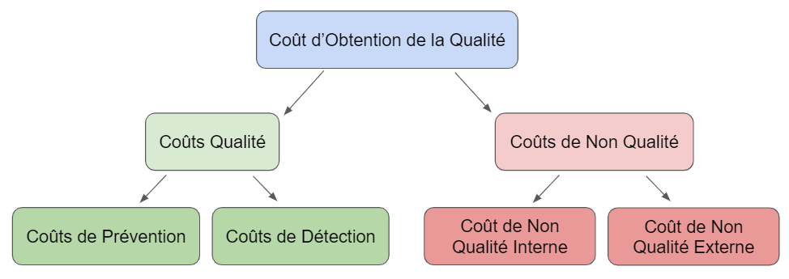

# Défis et Opportunités de la Qualité à Long Terme

## Introduction

La gestion de la qualité à long terme présente divers défis et opportunités pour les entreprises. L'équilibre entre la qualité et les coûts, l'adaptation à un environnement concurrentiel en constante évolution, et la capitalisation sur les innovations technologiques sont des aspects cruciaux pour maintenir et améliorer la qualité tout en atteignant les objectifs stratégiques à long terme. Ce guide explore en profondeur ces éléments pour offrir une vue complète des stratégies nécessaires pour gérer la qualité dans un contexte dynamique.

## 1. Défis de la Qualité à Long Terme

### 1.1 Compromis entre Qualité et Coûts

#### **Définition du Compromis**

Les entreprises doivent souvent faire des compromis entre la qualité des produits ou services et les coûts associés à leur production ou fourniture. Améliorer la qualité peut entraîner des coûts accrus, tandis que réduire les coûts peut parfois affecter la qualité des produits ou services offerts.

#### **Analyse des Coûts**

  
  

- **Coût de la Qualité :**
  
  - **Coûts de Prévention :** Investissements dans la formation, les audits de qualité, et les améliorations de processus pour éviter les défauts (par exemple, mise en place de systèmes de gestion de la qualité, formations des employés).
  - **Coûts d'Évaluation :** Coûts associés à l'inspection et aux tests pour détecter les défauts (par exemple, contrôles qualité, tests de validation).
  - **Coûts des Défauts Internes :** Coûts des produits rejetés ou corrigés avant la livraison aux clients (par exemple, re-travail, élimination des produits non conformes).
  - **Coûts des Défauts Externes :** Coûts des retours de produits, des garanties, et des plaintes des clients après livraison (par exemple, remboursements, réparations sous garantie).

- **Stratégies de Réduction des Coûts :**
  
  - **Optimisation des Processus :** Améliorer l'efficacité des processus pour réduire les déchets et les coûts tout en maintenant la qualité.
  - **Négociation avec les Fournisseurs :** Travailler avec les fournisseurs pour obtenir de meilleurs prix ou des conditions plus favorables tout en garantissant la qualité des matériaux.
  - **Production Lean :** Adopter des techniques de production lean pour éliminer les gaspillages et améliorer la qualité tout en réduisant les coûts.

#### **Stratégies pour Équilibrer :**

- **Amélioration Continue :** 
  
  - **Concept :** Investir dans des initiatives d’amélioration continue telles que Six Sigma, Lean, ou le modèle de maturité de la qualité pour réduire les coûts des défauts et améliorer les processus.
  - **Exemple :** Mise en œuvre du cycle PDCA (Plan-Do-Check-Act) pour itérer continuellement les processus et améliorer la qualité.

- **Analyse Coût-Bénéfice :**
  
  - **Définition :** Évaluer les coûts associés à l’amélioration de la qualité par rapport aux bénéfices attendus, tels que l’augmentation de la satisfaction client et la réduction des coûts liés aux défauts.
  - **Méthode :** Réaliser une analyse coûts-avantages pour déterminer si les investissements dans la qualité sont justifiés par les gains potentiels.

- **Gestion de la Valeur :**
  
  - **Définition :** Optimiser les coûts en tenant compte de la valeur perçue par le client. Cela implique de comprendre les attentes des clients et d’aligner les coûts de production avec ces attentes.
  - **Approche :** Évaluer la valeur ajoutée par les caractéristiques de qualité et ajuster les processus pour offrir cette valeur sans augmenter excessivement les coûts.

### 1.2 Naviguer dans un Paysage Concurrentiel en Constante Évolution

#### **Adaptabilité :**

- **Réactivité au Marché :**
  
  - **Importance :** La capacité à s'adapter rapidement aux changements des préférences des consommateurs, aux nouvelles tendances et aux innovations est cruciale pour rester compétitif.
  - **Stratégie :** Mettre en place des mécanismes de veille pour surveiller les tendances du marché et ajuster les stratégies de qualité en conséquence.

- **Surveillance Concurrentielle :**
  
  - **Définition :** Observer et analyser les stratégies des concurrents pour identifier les meilleures pratiques et les menaces potentielles.
  - **Méthode :** Utiliser des outils de benchmarking et des analyses de la concurrence pour obtenir des informations sur les approches de qualité des concurrents.

#### **Innovation :**

- **Recherche et Développement (R&D) :**
  
  - **Investissement :** Investir dans la recherche et le développement pour créer de nouveaux produits ou améliorer les produits existants. Cela aide à répondre aux besoins changeants des clients et à maintenir la compétitivité.
  - **Exemple :** Développer des nouveaux matériaux ou technologies pour améliorer la performance et la durabilité des produits.

- **Flexibilité des Processus :**
  
  - **Définition :** Adopter des processus de production flexibles qui peuvent être ajustés rapidement pour s’adapter aux changements de la demande ou aux nouvelles tendances du marché.
  - **Stratégie :** Utiliser des systèmes de production modulables et des méthodes de fabrication agiles pour répondre aux fluctuations du marché.

#### **Gestion de la Relation Client :**

- **Engagement Client :**
  
  - **Définition :** Créer des relations solides avec les clients en comprenant leurs besoins et en offrant des solutions adaptées.
  - **Méthode :** Utiliser des programmes de fidélisation, des enquêtes de satisfaction et des analyses des besoins des clients pour renforcer les relations.

- **Feedback Continu :**
  
  - **Collecte :** Recueillir des retours d'expérience des clients de manière régulière pour ajuster les produits ou services en fonction de leurs attentes.
  - **Analyse :** Analyser les retours clients pour identifier les opportunités d'amélioration et ajuster les processus de qualité.

### 1.3 Capitaliser sur les Innovations Technologiques

#### **Technologies Avancées :**

- **Automatisation :**
  
  - **Définition :** Intégrer des technologies d'automatisation pour améliorer l'efficacité des processus et réduire les erreurs humaines.
  - **Exemple :** Utiliser des robots pour effectuer des tâches de production répétitives avec une précision élevée.

- **Analyse de Données :**
  
  - **Définition :** Utiliser des outils d’analyse de données pour surveiller la performance en temps réel et identifier les tendances et anomalies.
  - **Outils :** Mettre en œuvre des systèmes d'analyse de données avancés et des logiciels de gestion de la qualité pour optimiser les processus.

#### **Innovations Produits :**

- **Technologie de Fabrication :**
  
  - **Définition :** Adopter des technologies avancées telles que l'impression 3D et la fabrication additive pour améliorer la qualité et la flexibilité de la production.
  - **Exemple :** Utiliser l'impression 3D pour créer des prototypes rapides ou des pièces personnalisées de haute qualité.

- **Solutions Numériques :**
  
  - **Définition :** Intégrer des solutions numériques pour améliorer la gestion de la qualité et le suivi des performances.
  - **Outils :** Utiliser des logiciels de gestion de la qualité et des plateformes de suivi pour optimiser les processus et garantir une qualité constante.

#### **Amélioration de l’Expérience Client :**

- **Applications Mobiles :**
  
  - **Définition :** Développer des applications mobiles pour offrir une meilleure expérience utilisateur et faciliter la communication avec les clients.
  - **Exemple :** Offrir des fonctionnalités telles que le suivi des commandes en temps réel ou des outils de personnalisation des produits.

- **Support Client Technologique :**
  
  - **Définition :** Utiliser des technologies telles que les chatbots et l’intelligence artificielle pour améliorer le support client et résoudre les problèmes de manière plus rapide et efficace.
  - **Exemple :** Intégrer un chatbot sur le site web pour répondre aux questions fréquemment posées et fournir une assistance instantanée.

## 2. Opportunités de la Qualité à Long Terme

### 2.1 Avantages Concurrentiels

#### **Différenciation :**

- **Produits de Haute Qualité :**
  
  - **Définition :** Offrir des produits ou services de haute qualité pour se différencier des concurrents et capturer une part de marché premium.
  - **Stratégie :** Mettre en avant les caractéristiques de qualité exceptionnelles dans les campagnes marketing pour attirer des clients prêts à payer plus pour une meilleure qualité.

- **Réputation de Marque :**
  
  - **Définition :** Construire une réputation solide basée sur la qualité des produits ou services.
  - **Méthode :** Investir dans des pratiques de qualité et de service client pour renforcer la marque et favoriser la fidélité des clients.

#### **Fidélisation des Clients :**

- **Expérience Client :**
  
  - **Définition :** Offrir une expérience exceptionnelle pour encourager les clients à revenir et recommander les produits ou services.
  - **Approche :** Utiliser des programmes de fidélisation, des offres personnalisées et des services après-vente de haute qualité pour maintenir une relation positive avec les clients.

### 2.2 Innovations Technologiques comme Opportunités

#### **Optimisation des Processus :**

- **Maintenance Prédictive :**
  
  - **Définition :** Utiliser l’Internet des Objets (IoT) et des capteurs pour anticiper les pannes d’équipements avant qu’elles ne se produisent.
  - **Exemple :** Mettre en œuvre des capteurs pour surveiller les équipements en temps réel et prédire les besoins de maintenance avant qu’une défaillance ne survienne.

- **Amélioration des Processus :**
  
  - **Définition :** Utiliser des outils de simulation et de modélisation pour optimiser les processus de production et améliorer la qualité.
  - **Outils :** Adopter des logiciels de simulation de processus pour tester et améliorer les procédures avant leur mise en œuvre.

#### **Développement Durable :**

- **Technologies Écologiques :**
  
  - **Définition :** Adopter des technologies qui réduisent l'impact environnemental tout en maintenant une haute qualité.
  - **Exemple :** Utiliser des matériaux recyclés ou des processus de production moins polluants pour minimiser l'empreinte écologique.

- **Responsabilité Sociale :**
  
  - **Définition :** Mettre en œuvre des pratiques de responsabilité sociale et environnementale pour répondre aux attentes des consommateurs.
  - **Approche :** Adopter des pratiques équitables et transparentes tout au long de la chaîne d'approvisionnement pour renforcer la confiance des consommateurs.

#### **Gestion des Risques :**

- **Identification des Risques :**
  
  - **Définition :** Effectuer des analyses pour identifier les menaces potentielles qui pourraient affecter la qualité.
  - **Méthode :** Utiliser des techniques telles que l'analyse SWOT (forces, faiblesses, opportunités, menaces) pour évaluer les risques et mettre en place des stratégies d’atténuation.

- **Plans de Contingence :**
  
  - **Définition :** Développer des plans pour gérer les risques identifiés et minimiser leur impact sur la qualité.
  - **Stratégie :** Créer des procédures d’urgence et des plans de réponse pour gérer les crises et assurer la continuité des opérations.

- **Surveillance Continue :**
  
  - **Veille Technologique :**
    
    - **Définition :** Mettre en place une veille pour suivre les évolutions technologiques et les tendances du marché.
    - **Approche :** Utiliser des outils de veille pour rester informé des nouvelles technologies et adapter les stratégies de qualité en conséquence.

  - **Évaluation Régulière :**
    
    - **Définition :** Réévaluer périodiquement les processus et les stratégies de qualité pour assurer leur pertinence et leur efficacité.
    - **Méthode :** Effectuer des audits internes réguliers et des revues de performance pour ajuster les stratégies de qualité en fonction des résultats obtenus.

## Conclusion

La gestion de la qualité à long terme nécessite une approche stratégique qui tient compte des défis et des opportunités liés aux compromis entre qualité et coûts, à l'évolution du paysage concurrentiel, et aux innovations technologiques. En surmontant ces défis et en exploitant ces opportunités, les entreprises peuvent améliorer leur performance, renforcer leur position sur le marché, et assurer leur succès durable. Une gestion proactive et adaptative de la qualité est essentielle pour naviguer dans un environnement dynamique et atteindre les objectifs à long terme.

