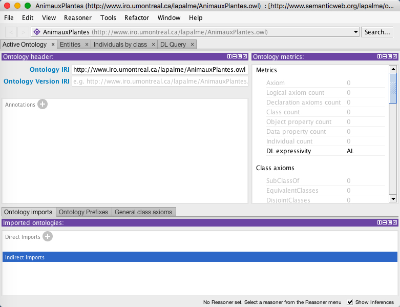
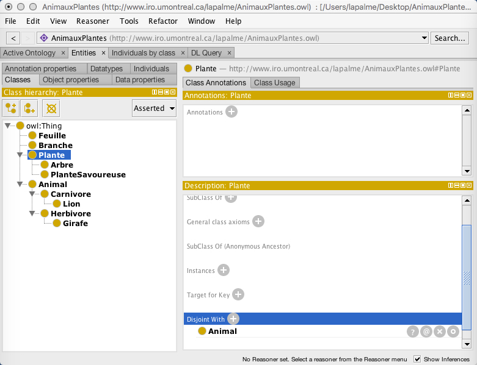
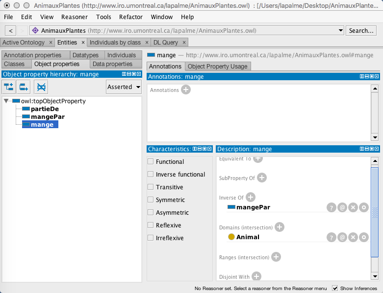
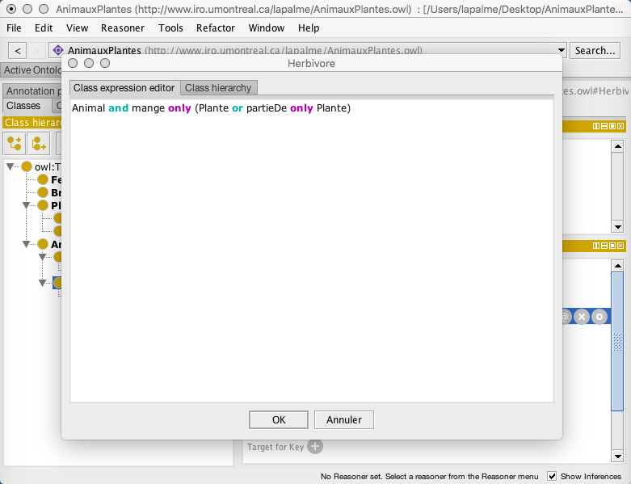
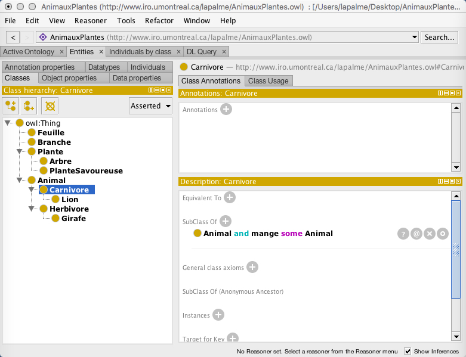
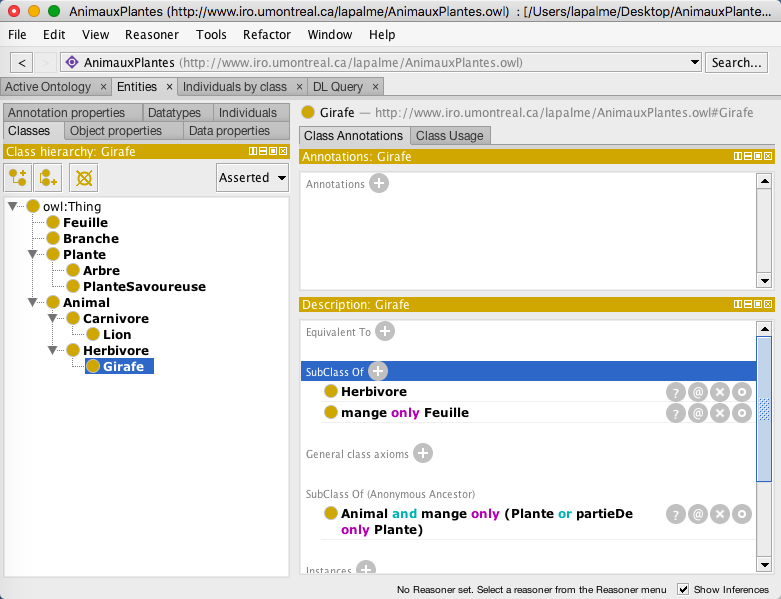
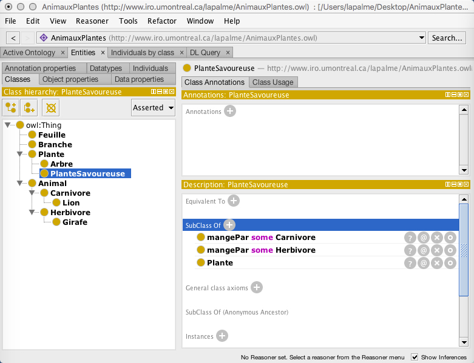
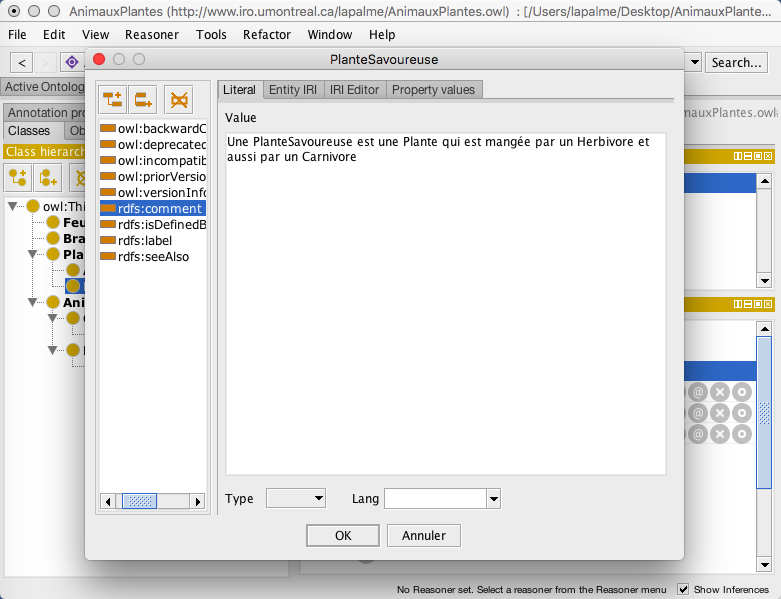
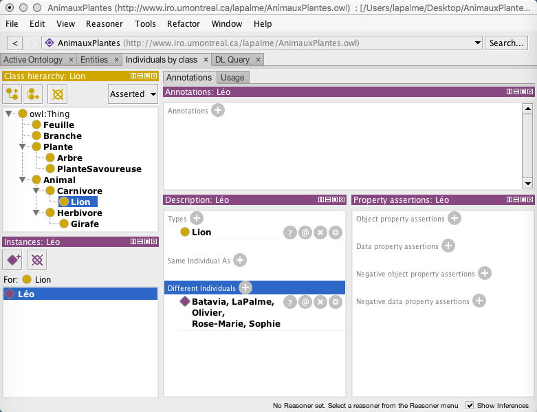
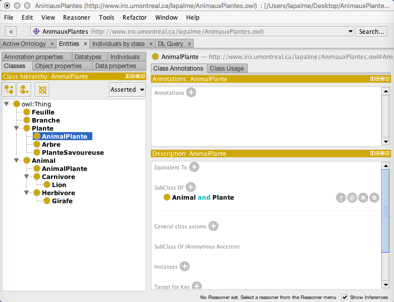

# TP3 - Protégé

# Partie 01

Ce `TP3` a pour objectif de vous apprendre à créer une `ontologie` à travers l'utilisation du logiciel `Protégé` (https://protege.stanford.edu/).

## 1.1 Définition de l’ontologie

Cette `ontologie` est adaptée de l’exemple 3.1 (p 17) d’un texte de Grigoris Antoniou and Frank van Harmelen (http://www.cs.vu.nl/~frankh/postscript/OntoHandbook03OWL.pdf). Elle était aussi présentée dans la deuxième édition Semantic Web Primer (p 135 et suivantes) (http://www.ics.forth.gr/isl/swprimer/).

Pour simplifier :

- les `mots` qui désigneront une `classe` seront en `gras` et avec la première lettre en
`majuscule` ;

- les `propriétés` seront en `italique` avec sa première lettre en `minuscule` ;
- les `autres mots` seront en `police normale`.

NB : Les choix de conception de l’`ontologie` devraient en principe être faits suite à
une analyse complète des besoins, mais nous les imposons ici pour les besoins de cet
exercice.

1. Un `Animal` est une `classe`.
2. Une `Plante` est une `classe`, mais disjointe d’`Animal`.
3. Un `Arbre` est une `sous-classe` de `Plante`.
4. Une `Branche` est une partie d’un `Arbre`.
5. Une `Feuille` est une partie d’une `Branche`.
6. Un `Herbivore` est un `Animal` qui ne mange qu’une `Plante` ou une partie d’une
    `Plante`.
7. Un `Carnivore` est un `Animal` qui mange aussi un `Animal`.
8. Une `Girafe` est un `Herbivore` qui ne mange que des `Feuilles`.
9. Un `Lion` est un `Carnivore` qui ne mange que des `Herbivores`.
10. Une `Plante Savoureuse` est une `Plante` qui est mangée par un `Herbivore` et aussi par un `Carnivore`.

## 1.2 Étapes de création de l’ontologie

- Identifiez l’icone de `Protégé` et lancez le.

- Vous devriez obtenir une interface Protégé semblable à la figure suivante. Celle-ci peut
différer légèrement suivant les plateformes. Pour ce tutoriel, vous pouvez ignorer les
mises à jour `deplug-inoffertes` au lancement du programme.

Interface Protégé

- Définir l’Ontology `IRI` pour un `URI` qui vous ressemble.
  
- Dans le menu système `File/Save`, indiquer le format de sauvegarde de l’onto-
logie, c’est-à-dire `RDF/XML` et l’endroit sur votre disque où sera conservée
l’ontologie.

- En principe, votre écran devrait ressembler à celui de la figure précédente.
L’écran est divisé en vues(views en anglais) qui dépendent des onglets(tabs en anglais) accessibles en cliquant sur un des éléments d’une liste de titres `Active Ontology`, `Entities`, etc.

- Appuyer sur chacun de ses onglets pour constater les changements d’affichage des vues. Certaines vues (par exemple `Entities`) possèdent eux-mêmes des sous-onglets qui ont eux-mêmes plusieurs vues. On peut configurer l’écran en ajoutant des vues et des onglets(tabs) dans les menus `Window>View` et `Window>Tabs`. Voir la page http://protegeproject.github.io/protege/views/ pour plus de détails sur la manipulation de l’interface. Des vidéos expliquent comment manipuler les vues (https://www.youtube.com/watch?time_continue=4&v=JObQC-L2piA) et les onglets (https://www.youtube.com/watch?time_continue=20&v=rO2pYQr1l-M).

### 1.2.1 Définition des classes simples

- Dans l’onglet `Entities`, choisir le sous-onglet `Classes`. Cliquer sur le mot `owl:Thing` dans la vue `Class hierarchy` qui est la racine de toutes les classes que nous allons créer.En appuyant sur le premier bouton en haut à gauche de cette vue, un dialogue apparait qui permet de créer une classe qui sera un enfant de la classe sélectionnée. On peut ainsi définir des `sous-classes`. Le deuxième bouton permet de créer une `classe soeur` de la classe sélectionnée. Le troisième bouton détruit la classe sélectionnée ainsi que ses `sous-classes`.

- Faire de même pour créer la hiérarchie des classes dont les noms sont `en gras` dans la liste des énoncés ci-dessus pour obtenir la figure suivante (ne pas tenir compte de l’ordre des classes et sous-classes). Ne définir ici que les noms des classes et leur hiérarchie, sans tenir compte des autres types de contraintes pour le moment.
  
`Attention` : Ne pas oublier d’indiquer que les classes Plante et Animal sont disjointes en choisissant une de celles-ci et en indiquant l’autre dans `Disjoint With` de la vue `Description`.

Création des classes simples. La partie droite de l’écran permet de voir des
informations sur les classes et d’en changer les caractéristiques.

### 1.2.2 Définition des propriétés

Appuyer sur l’onglet `Object Properties` et, en utilisant le bouton en haut à gauche, créer les 3 propriétés suivantes :

- `mange` dont le domaine est un `Animal`: choisir l’onglet `Class hierarchy` dans la fenêtre qui apparaît en cliquant sur le `+` à l’item `Domains(intersections)` de la vue `Description`

- `mangePar` inverse de `mange` en choisissant la propriété dans la fenêtre qui apparaît en cliquant sur le `+` à l’item `inverse Of` de la vue `Description`

- `partieDe` transitive indiquée en cochant `Transitive` dans la vue `Characteristics`

Vous devriez obtenir la suivante.

Sauver l’ontologie avec l’item `Save` du menu `File`. Ceci créera un fichier dans le format `RDF/XML` qu’il peut être instructif d’ouvrir avec un éditeur de texte ou `XML` pour voir le code généré par `Protégé`.

Définition des propriétés.

### 1.2.3 Définition des classes complexes

Revenir dans l’onglet `Classes` pour compléter les descriptions de classes complexes.

Pour l’énoncé 4 :

« Une Branche est une partie d’un Arbre»

- Il faut choisir la classe `Branche` dans la vue `Class hierarchy` et cliquer sur `SubClass Of` dans la vue `Description` pour faire apparaître une fenêtre permettant de définir une expression définissant la `superclasse`. Dans cette fenêtre, choisir l’onglet `Object restriction creator` et sélectionner la propriété `partieDe` à gauche, `Arbre` à droite et `Only(universal)` dans le menu en bas comme dans la figure suivante.

Définition des propriétés.

Ceci permet d’exprimer qu’une branche fait toujours partie d’un arbre et lorsqu’on clique `OK`, on obtient sous la rubrique `SubClass Of` de la vue `Description` l’expression correspondante en syntaxe de Manchester (https://www.w3.org/TR/owl2-manchester-syntax/) :`partieDe only Arbre` (http://protegeproject.github.io/protege/class-expression-syntax/).

Effectuer une manipulation similaire pour l’énoncé 5 :

« Une Feuille est une partie d’une Branche»

De façon à obtenir l’expression `partieDe only Branche` comme `SubClass Of` de Feuille.

Pour l’énoncé 6 :

« Un Herbivore est un Animal qui ne mange qu’une Plante ou une partie d’une Plante»

Choisir `Herbivore` dans la vue `Class hierarchy` et, dans la vue `Description` à l’item `SubClass Of`, cliquer sur le dernier bouton à droite `(Edit)` pour écrire `Animal and mange only (Plante or partieDe only Plante)` directement l’expression en syntaxe de `Manchester` dans l’onglet `Class expression editor` de la fenêtre qui apparaît dant la figure suivante.

Définition de l’énoncé 6 (expression en syntaxe de Manchester.

Au lieu de taper les noms des `classes` ou `propriétés`, on peut les glisser à partir d’autres vues et ainsi éviter des erreurs de frappe. L’éditeur effectue une vérification syntaxique de l’expression à mesure de la frappe. Il est possible d’obtenir une liste de suggestions en tapant sur `CTRL-espace` ou `TAB` en tout temps.

Pour l’énoncé 7 :

« Un Carnivore est un Animal qui mange aussi un Animal.»

Modifier la définition de la `superclasse` pour indiquer qu’un `carnivore` peut aussi manger un autre carnivore pour obtenir la figure suivante :

Définition de l’énoncé 7.

Pour l’énoncé 8 :

« Une Girafe est un Herbivore qui ne mange que des Feuilles. »

Ajouter une `superclasse` pour obtenir la figure 7 :

Définition de l’énoncé 8.

Pour l’énoncé 9 :

«Un Lion est un Animal qui ne mange que des Herbivores.»

Ajouter une `superclasse` pour obtenir la figure suivante :

Définition de l’énoncé 9.

Pour l’énoncé 10 :

«Une Plante Savoureuse est une Plante qui est mangée par un Herbivore et aussi par un Carnivore»

Ajouter deux `superclasses` à Plante Savoureuse pour obtenir la figure suivante :

Définition de l’énoncé 10.

Lorsque les expressions de classe deviennent complexes, il est utile d’ajouter une annotation de type `comment (un commentaire)` en appuyant sur le signe `+` à côté de `Annotations` dans la vue `Annotations` (voir la figure suivante).

Sauvez votre ontologie dans le format `RDF/XML`. Il peut être instructif d’ouvrir le
fichier que vous venez de sauver avec un éditeur de texte ou `XML` pour voir le code
généré par `Protégé`.

Il est possible de voir le rendu `RDF/XML` dans l’onglet `Active Ontology` la vue `RDF/XML Rendering` qui affiche le contenu de l’ontologie dans cette syntaxe. Si cette vue n’apparaît pas, choisissez l’item de menu système `Window>Views>Ontology Views>RDF/XML Rendering` et placer le point qui apparaît au milieu de la vue du bas et cliquer pour y ajouter cette nouvelle vue. Cette vue est générée à partir des informations conservées par `Protégé`, elle ne peut pas permettre à l’utilisateur de modifier l’ontologie lui-même.

Il peut être intéressant d’explorer la hiérarchie à l’onglet `globalDL Query`. L’interrogation de l’ontologie est effectuée avec un langage spécial inspiré de la syntaxe de `Manchester` (voir http://protegewiki.stanford.edu/wiki/DLQueryTab).

Il est aussi possible d’avoir une visualisation de l’ontologie avec la vue `OntoGraf` disponible à `Window>Views>Class views>Ontograf`.

Exemple d’ajout de commentaires.

## 1.3 Ajout d’individus

Ajouter des instances des classes dans l’onglet `Individuals by class` en sélectionnant une classe dans la vue en haut à gauche et en ajoutant un individu comme membre dans la vue `Instances`.

Ajouter les individus suivants :

- `Léo` le `Lion`
- `Sophie` la `Girafe`
- `Olivier` l’`Arbre`
- `Rose-Marie` la `Plante Savoureuse`
- `Batavia` la `Feuille`
- `LaPalme` la `Branche`.

Pour indiquer que ces individus sont tous différents, il suffit d’en choisir un et d’appuyer sur le `+` à côté de `Different individuals` dans la vue `Description` et de sélectionner les autres individus dans la fenêtre qui apparaîtra. Tous les individus seront alors considérés comme distincts comme on peut le constater en les sélectionnant dans la vue `Individuals`.

On obtient la figure suivante :

Ajout d’individus.

## 1.4 Vérification de la cohérence de l’ontologie

Le grand intérêt de l’utilisation de `Protégé` est la possibilité de vérifier si l’ontologie créée ne contient pas des définitions contradictoires. Avec une ontologie aussi simpliste que celle que nous avons construite dans ce document, il est facile de vérifier manuellement la cohérence du tout mais ceci est pratiquement impossible pour des cas plus complexes. Nous allons illustrer le processus de vérification en créant une classe qui serait à la fois une plante et un animal.

Ajouter une nouvelle classe `AnimalPlante` sous `owl:Thing` et définir à `SubClass Of` l’expression `Animal` and `Plante`. La classe `AnimalPlante` sera alors placée à la fois sous `Animal` et `Plante` comme dans la figure suivante :

Ajout de la classe AnimalPlante.

Dans le menu `Reasoner`, sélectionner `HermiT`, s’il n’y a pas déjà un crochet dans l’item de menu ; sélectionner ensuite `Start Reasoner`.

Dans la vue `Class hierarchy` en choisissant l’item de menu `Inferred` devraientapparaître les classes inconsistantes en rouge, comme dans la figure suivante.

La classe `AnimalPlante` apparaît comme inconsistante car nous avons déclaré (à l’énoncé 2) que les classes `Animal` et `Plante` doivent être disjointes. Cette explication est d’ailleurs fournie par `Protégé` si on clique sur le point d’interrogation à côté de `owl:Nothing` dans la vue `Description`.

Pour revenir à une ontologie consistante, il suffit d’éliminer la définition des superclasses de `AnimalPlante`. Il faut choisir l’item de menu `Asserted`, choisir la classe à éliminer et cliquer sur le troisième bouton. Pour s’assurer que tout est maintenant cohérent, choisir à nouveau `Synchronize reasoner` dans le menu système `Reasoner`.

Il ne devrait plus rien apparaître sous l’item `Nothing` en rouge dans la vue `Class hierarchy` lorsqu’on choisit l’item `Inferred`.

Identification des classes inconsistantes.

## 1.5 Pour aller plus loin...

Ce petit exemple ne fait pas ressortir toutes les possibilités de `Protégé`, en particulier nous n’avons pas expliqué comment modifier les vues et leur position, ou la création de plusieurs classes en spécifiant leur hiérarchie, ni toutes les subtilités de la modélisation d’`ontologie`.

La prochaine étape devrait être maintenant de lire et d’expérimenter avec `A Practical Guide To Building OWL Ontologies Using Protégé 4 and CO-ODE Tools` (https://www.uio.no/studier/emner/matnat/ifi/IN3060/v19/undervisningsmateriale/protegeowltutorialp4_v1_3.pdf) qui développe en détails l’exemple du domaine de la pizza qui est aussi exploré dans un autre tutoriel (https://protegewiki.stanford.edu/wiki/Protege4Pizzas10Minutes). Ces tutoriels utilisent une version antérieure de l’interface de `Protégé`, mais les principes de base restent les mêmes.

# Partie 02

Après avoir téléchargé l’ontologie des `Pizza` (http://protege.stanford.edu/
ontologies/pizza/pizza.owl), chargez la dans `Protégé` (`File>Open`).

Identifiez :

- Les `classes principales`.
- Les `propriétés`.
- Les `classes complexes`.

Ajoutez un type de pizza (voir par exemple http://www.chickenpizzamonaco.com/Menu.pdf).

# Partie 03

Construisez l’`ontologie` correspondant à la carte conceptuelle que vous avez défini lors du précédent `TP`.

