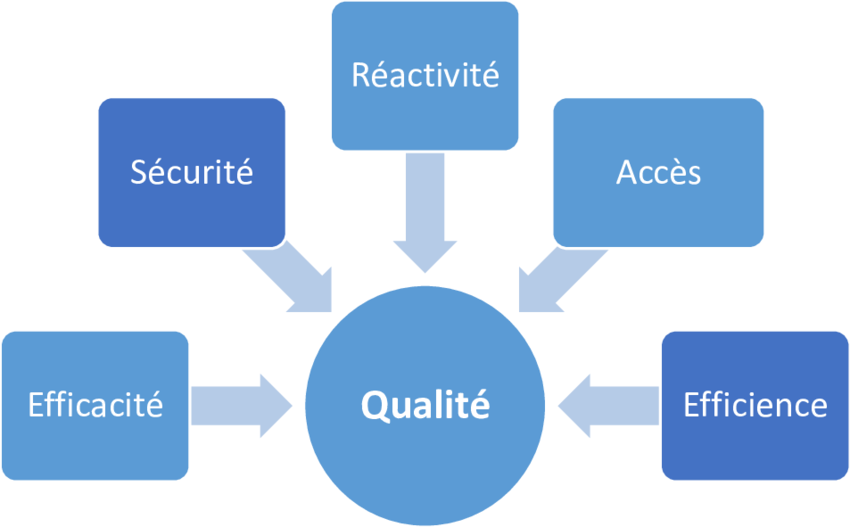
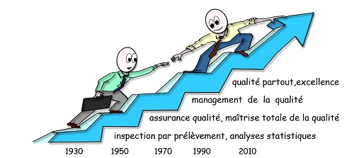
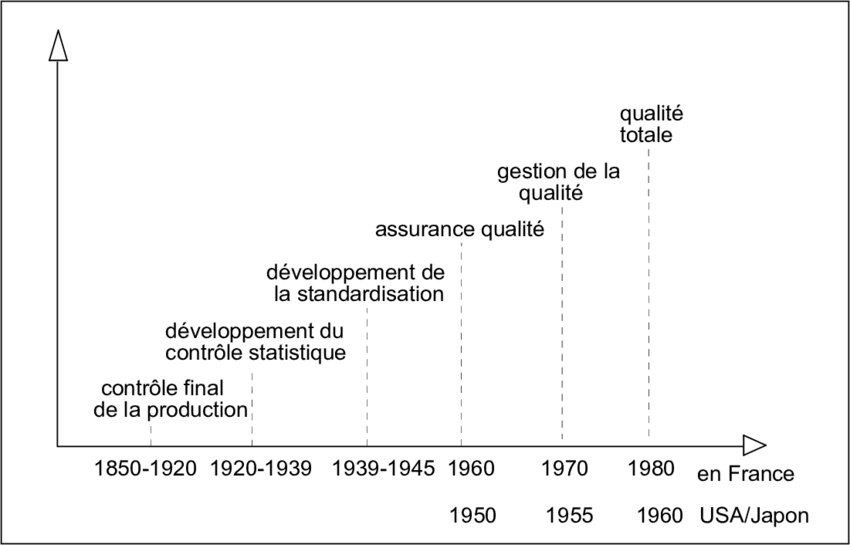

# Introduction à la Qualité

## 1. Définition de la Qualité

La qualité est un concept multidimensionnel qui peut être défini de différentes manières selon les contextes, mais en général, elle se réfère à la capacité d'un produit ou d'un service à satisfaire les attentes et besoins des clients. Elle est perçue comme un indicateur clé de performance pour les entreprises. Une bonne qualité signifie non seulement l'absence de défauts mais aussi la capacité à répondre aux spécifications et aux exigences du client de manière cohérente.

### Points clés de la définition :
- **Conformité aux spécifications** : Cela signifie que le produit ou service respecte rigoureusement les critères techniques et fonctionnels établis avant la production.
- **Adaptation à l'usage** : Un produit de qualité doit non seulement respecter les spécifications, mais aussi être approprié pour l'usage prévu par le client.
- **Amélioration continue** : La qualité n'est pas un objectif statique. Elle implique un processus d'amélioration continu afin de mieux répondre aux attentes et d'optimiser les processus internes.

---

## 2. Dimensions de la Qualité

  
  

La qualité d'un produit ou service peut être mesurée à travers plusieurs dimensions. Chacune de ces dimensions permet de comprendre un aspect spécifique de ce qu'est un produit ou service de qualité.

### Principales dimensions de la qualité :

1. **Performance** : Cela se réfère à la capacité du produit ou service à accomplir la tâche pour laquelle il a été conçu. Par exemple, un ordinateur de qualité doit pouvoir exécuter des programmes sans ralentissements significatifs.
   
2. **Fiabilité** : Cette dimension mesure la capacité d’un produit ou service à fonctionner correctement et sans défaillances pendant une période donnée. Un produit fiable fonctionne comme prévu sans pannes répétées.

3. **Durabilité** : La durabilité correspond à la durée de vie d’un produit avant qu’il ne nécessite une réparation ou un remplacement. Un produit de qualité doit offrir une durée d'utilisation satisfaisante.

4. **Conformité** : Elle se réfère à la correspondance entre les caractéristiques d’un produit et les standards ou spécifications préétablies. Un produit conforme respecte les attentes définies à l'avance.

5. **Caractéristiques** : Ce sont des aspects supplémentaires qui vont au-delà des fonctionnalités de base, et qui offrent un avantage supplémentaire pour le client. Par exemple, une voiture équipée d’un système de navigation est perçue comme de meilleure qualité.

6. **Esthétique** : Il s’agit de l’aspect visuel, du design et de la sensation que procure le produit. Un produit esthétiquement plaisant est souvent perçu comme de meilleure qualité, bien que cela soit subjectif.

7. **Service après-vente** : Cela inclut l'assistance apportée au client après l'achat, comme la garantie ou le support technique. Un bon service après-vente est une dimension importante pour la satisfaction client.

---

## 3. Historique et Évolution de la Qualité

  
  

L'histoire de la qualité est longue et s'étend sur plusieurs siècles. Elle a évolué de manière significative, passant d'un contrôle artisanal à des processus industrialisés et hautement standardisés. Voici un aperçu de cette évolution :

### Antiquité et Moyen Âge
- **Période artisanale** : Dans les temps anciens, la qualité était assurée par des artisans individuels qui fabriquaient des produits selon des méthodes manuelles. Les artisans étaient responsables de chaque étape de la production, et la qualité était directement liée à leur savoir-faire.

### Révolution industrielle (18e-19e siècles)

  
  

- **Transition vers la production de masse** : Avec la révolution industrielle, la production de masse a commencé à remplacer le travail artisanal. Cela a nécessité une standardisation accrue pour garantir une qualité homogène sur de grandes quantités. La qualité a commencé à être vue à travers le prisme de la conformité aux spécifications et de l'efficacité de production.

### Années 1920

- **Contrôle statistique de la qualité** : Introduit par Walter Shewhart, le contrôle statistique de la qualité a permis aux entreprises de surveiller et d'améliorer la qualité tout au long du processus de fabrication. Ce système a marqué le début de la gestion moderne de la qualité, avec un accent sur la réduction des variations.

### Années 1950-1960

- **L'après-guerre et l'influence japonaise** : Après la Seconde Guerre mondiale, le Japon a adopté une approche de qualité tournée vers l'amélioration continue, en intégrant des principes avancés enseignés par des experts comme **W. Edwards Deming** et **Joseph Juran**. Ce mouvement a donné naissance à la gestion de la qualité totale (**Total Quality Management, TQM**), qui place la qualité au cœur de toutes les fonctions de l'entreprise.

### Années 1980-2000

- **Six Sigma et Lean** : Dans les années 1980, **Motorola** a développé le concept de **Six Sigma**, une méthodologie qui vise à minimiser les défauts dans les processus de production grâce à l'analyse statistique et à l'optimisation des processus. Parallèlement, la méthode **Lean** (inspirée du modèle de Toyota) s'est concentrée sur l’élimination des gaspillages dans la chaîne de production tout en maintenant une haute qualité.

### Aujourd'hui

  
  

- **Normes ISO** : La qualité est désormais une priorité stratégique pour les entreprises, avec des normes internationales telles que l'**ISO 9001** qui fournissent des cadres normatifs pour garantir la qualité à l’échelle mondiale. Les entreprises adoptent également des systèmes intégrés de gestion de la qualité afin de répondre aux exigences des clients et de se conformer aux régulations internationales.

---

## Conclusion

L'introduction à la qualité révèle qu'il ne s'agit pas uniquement de produits ou de services sans défaut, mais d'une approche globale qui couvre toutes les dimensions de la production, du design au service après-vente. La qualité évolue avec le temps et les besoins du marché, et elle est aujourd'hui au centre des stratégies d'amélioration continue dans de nombreuses industries. La gestion de la qualité est devenue un outil essentiel pour assurer la satisfaction des clients, la durabilité des produits et l'efficacité des processus industriels.
