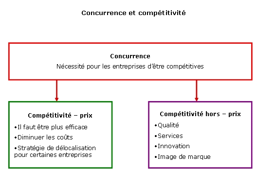
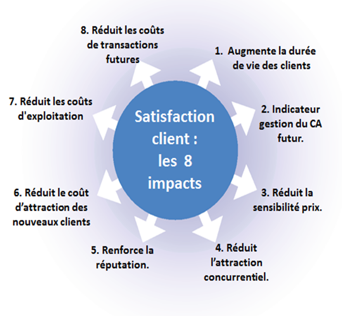
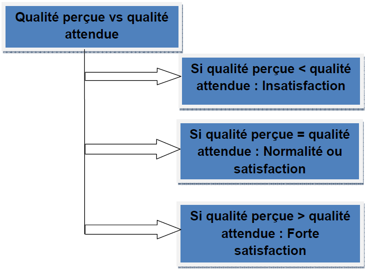
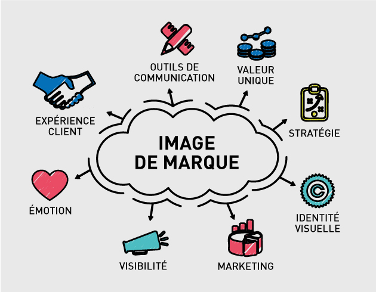
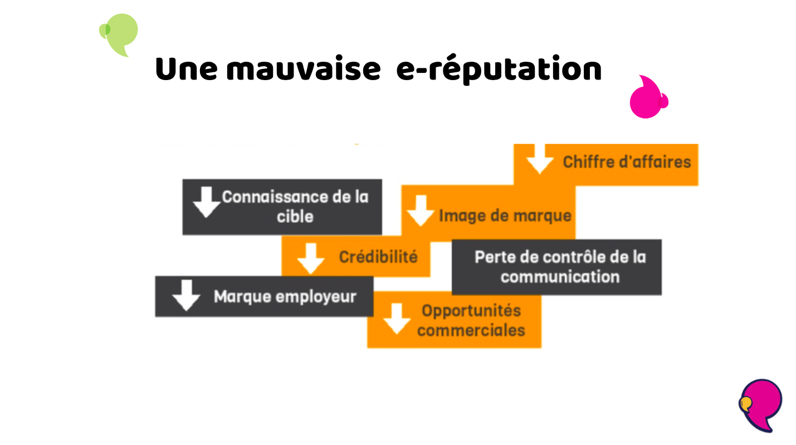
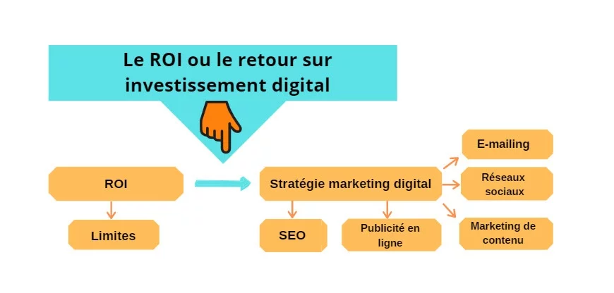
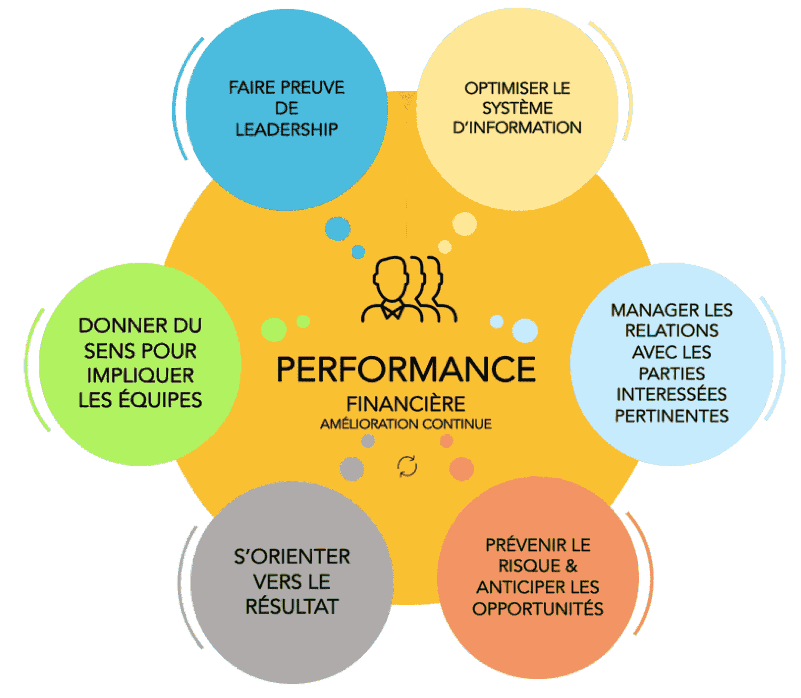

# La Qualité comme Avantage Concurrentiel

  
  

La qualité est devenue un levier stratégique majeur pour les entreprises qui cherchent à se différencier sur des marchés de plus en plus compétitifs. Elle impacte directement la satisfaction des clients, la réputation de la marque, et influence le retour sur investissement (ROI). Adopter une approche centrée sur la qualité permet non seulement de répondre aux attentes des clients, mais aussi d'assurer la pérennité et la rentabilité de l'entreprise.

---

## 1. Qualité et Satisfaction du Client

  
  

La satisfaction des clients est l’un des objectifs primordiaux des entreprises. Elle est fortement influencée par la qualité du produit ou service proposé. La qualité perçue par le client va bien au-delà des caractéristiques techniques du produit ; elle englobe également l'expérience utilisateur, la fiabilité du produit, ainsi que la qualité du service après-vente.

### 1.1 Définition de la satisfaction du client

La satisfaction du client est le résultat de l’adéquation entre les attentes d’un consommateur et son expérience réelle avec un produit ou service. Lorsque la qualité perçue d'un produit dépasse les attentes initiales, le client est satisfait, voire enchanté. Si le produit ne correspond pas aux attentes, cela engendre de la frustration et des plaintes, voire la perte du client.

### 1.2 Impact de la qualité sur la satisfaction

La qualité influence directement plusieurs dimensions de la satisfaction client :
- **Performance** : Un produit qui fonctionne correctement et qui offre des résultats constants sur une longue période génère de la satisfaction.
- **Fiabilité** : La capacité du produit à remplir sa fonction sans défaillance répétée augmente la confiance du client.
- **Durabilité** : Un produit durable est souvent perçu comme un produit de meilleure qualité, car il ne nécessite pas de remplacement ou de réparation fréquents.
- **Esthétique et conception** : Un design attrayant et une attention particulière aux détails améliorent la perception globale du produit.

### 1.3 Qualité perçue et valeur ajoutée

  
  

La **qualité perçue** est souvent un facteur clé de la satisfaction client, parfois même plus que la qualité objective. Les entreprises peuvent influencer la qualité perçue en améliorant l'expérience utilisateur, en offrant un excellent service client, et en proposant des caractéristiques supplémentaires qui ne sont pas nécessairement techniques mais qui ajoutent de la valeur (par exemple, un packaging soigné ou une interface utilisateur intuitive).

### 1.4 Impact sur la fidélisation des clients

- **Fidélité** : Lorsque les attentes en termes de qualité sont satisfaites de manière constante, les clients sont plus susceptibles de rester fidèles à la marque.
- **Bouche-à-oreille positif** : Les clients satisfaits recommandent la marque à leurs amis, collègues ou sur les réseaux sociaux, ce qui renforce la réputation de l'entreprise et peut attirer de nouveaux clients.
- **Rachat** : Un client satisfait par la qualité du produit ou service est plus enclin à racheter dans le futur, réduisant ainsi les coûts d'acquisition de nouveaux clients pour l'entreprise.

### 1.5 Importance de l'amélioration continue pour la satisfaction

Les attentes des clients évoluent avec le temps, tout comme la technologie et les tendances du marché. Pour maintenir un haut niveau de satisfaction, il est essentiel d'adopter une approche d'**amélioration continue**, notamment à travers des audits de qualité, des retours clients réguliers, et la mise à jour des produits/services pour répondre aux nouvelles attentes.

---

## 2. Impact de la Qualité sur la Marque et la Réputation

  
  

La qualité est un facteur central dans la création et le maintien d'une image de marque forte. Une entreprise qui propose des produits ou services de qualité supérieure est plus susceptible d’être perçue comme fiable, innovante et crédible. Cela renforce non seulement sa réputation auprès des consommateurs, mais aussi auprès des investisseurs et partenaires.

### 2.1 Qualité et image de marque

La qualité est un des principaux vecteurs de différenciation sur des marchés où de nombreux concurrents proposent des produits similaires. Une marque qui se distingue par la qualité gagne en crédibilité et en confiance auprès de ses clients.

#### Avantages d'une marque associée à la qualité :
- **Premiumisation** : Les produits de haute qualité peuvent être positionnés sur des segments premium, permettant de pratiquer des prix plus élevés.
- **Loyauté des clients** : Une entreprise qui offre une qualité constante au fil du temps gagne la fidélité de ses clients.
- **Barrière à l'entrée pour les concurrents** : Les concurrents qui veulent s'imposer doivent fournir un niveau de qualité similaire ou supérieur, ce qui rend plus difficile la conquête de parts de marché.

### 2.2 Conséquences d’une mauvaise qualité sur la réputation

  
  

L'impact d'une mauvaise qualité sur une entreprise peut être catastrophique. En cas de défauts répétés ou d'incidents liés à la qualité (rappels de produits, accidents, etc.), l'entreprise peut subir de graves répercussions en termes d'image et de réputation.

#### Exemples d'effets négatifs :
- **Médiatisation des défaillances** : Les scandales liés à des produits de mauvaise qualité se propagent rapidement, surtout à l’ère des réseaux sociaux.
- **Perte de confiance des consommateurs** : Une expérience négative peut avoir un impact durable sur la perception des consommateurs, même après la résolution du problème.
- **Baisse des ventes et parts de marché** : Lorsque la réputation de l’entreprise est entachée, les clients se tournent souvent vers la concurrence.

### 2.3 La gestion de la qualité pour maintenir la réputation

Pour éviter des crises liées à la qualité, les entreprises doivent mettre en place un **système de gestion de la qualité** rigoureux. Cela inclut des contrôles qualité à chaque étape de la production, la formation continue des employés, et une réactivité face aux retours des clients pour identifier rapidement les problèmes et les résoudre.

---

## 3. Retour sur Investissement (ROI) de la Qualité

  
  

Investir dans la qualité nécessite des ressources, mais ces efforts peuvent générer des bénéfices tangibles à long terme, tant au niveau des revenus que de la réduction des coûts opérationnels. Le **retour sur investissement (ROI)** de la qualité se manifeste sous plusieurs formes, allant de la diminution des coûts de production à l'augmentation des ventes grâce à une meilleure fidélité des clients.

### 3.1 Coûts de la qualité vs coûts de la non-qualité

Investir dans la qualité peut sembler coûteux, mais les **coûts de la non-qualité** peuvent être bien plus importants à long terme.

#### Exemples de coûts de la non-qualité :
- **Coûts internes** : Mauvaise organisation des processus, gaspillage de matières premières, inefficience des machines, etc.
- **Coûts externes** : Retours produits, garantie, rappels, réparations, compensations aux clients.
- **Coûts intangibles** : Dommages à la réputation, perte de clients, baisse de confiance des investisseurs.

### 3.2 Amélioration des marges grâce à la qualité

  
  

En augmentant la qualité, une entreprise peut :
- **Réduire les coûts de reprise et d'échec** : Moins de défauts signifie moins de retours, moins de réparations et moins de gaspillage.
- **Augmenter la satisfaction et la fidélité** : Une meilleure qualité entraîne des clients plus satisfaits et fidèles, réduisant les coûts liés à l'acquisition de nouveaux clients.
- **Justifier des prix plus élevés** : Les produits de qualité supérieure peuvent être vendus à des prix plus élevés, augmentant ainsi les marges bénéficiaires.

### 3.3 Lien entre qualité et performance financière

Les entreprises qui investissent dans la qualité voient souvent des **améliorations significatives de leurs performances financières**. Non seulement elles réduisent les coûts d’exploitation à travers des processus plus efficaces, mais elles augmentent aussi leurs revenus en attirant de nouveaux clients et en fidélisant les clients existants.

#### Exemples de bénéfices financiers liés à la qualité :
- **Augmentation des ventes** : Les produits de haute qualité ont tendance à se vendre mieux, générant ainsi des revenus supplémentaires.
- **Réduction des coûts d'exploitation** : Les processus optimisés et les produits fiables réduisent les coûts de production et de maintenance.
- **Meilleur accès aux marchés internationaux** : Les certifications de qualité (comme ISO 9001) permettent d’accéder à des marchés plus exigeants et d’établir des partenariats avec des entreprises de renom.

### 3.4 Amortissement des investissements dans la qualité

Bien que l'amélioration de la qualité puisse nécessiter des investissements importants, notamment en formation, en infrastructure ou en technologies, ces coûts sont souvent rapidement amortis par les gains réalisés en termes de productivité, d'efficacité et de satisfaction client.

#### Principaux leviers d'amortissement :
- **Réduction des coûts de non-qualité** : Diminuer les erreurs permet d'économiser sur les réparations, les retours et les pertes liées à la mauvaise production.
- **Réduction des coûts d'acquisition de clients** : Des clients satisfaits deviennent des ambassadeurs de la marque, réduisant ainsi les dépenses en marketing.
- **Amélioration des processus** : L’investissement dans des méthodes de contrôle qualité avancées permet de réduire les gaspillages, d’améliorer les délais de production et d’augmenter la capacité à livrer des produits sans défauts.

---

## Conclusion

En résumé, la qualité est bien plus qu'un simple facteur de conformité. Elle représente un véritable avantage concurrentiel qui permet aux entreprises de se différencier sur le marché, de fidéliser leur clientèle, d'améliorer leur image de marque et d'optimiser leurs performances financières. En investissant dans la qualité, les entreprises peuvent espérer un retour sur investissement significatif à long terme, tout en assurant leur pérennité dans un environnement concurrentiel.
