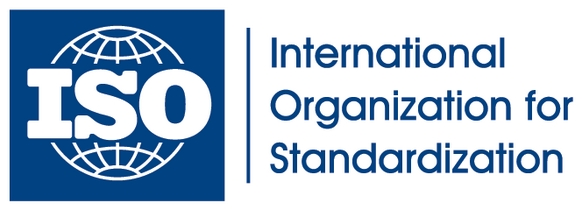

# Outils et Technologies de la Gestion de la Qualité

Les outils et méthodologies de gestion de la qualité sont essentiels pour garantir l'efficacité des processus de production et la satisfaction des clients. Ils permettent d'identifier les défauts, de standardiser les pratiques et d'améliorer continuellement les produits ou services. Dans cette section, nous explorerons les principales méthodologies de gestion de la qualité telles que Six Sigma, Lean, et plusieurs outils de contrôle de la qualité. Nous aborderons également les normes ISO, qui sont des certifications internationales garantissant un certain niveau de qualité.

---

## 1. Méthodologies de Gestion de la Qualité

  
  
Les 7 principes du management de la qualité

### 1.1 Six Sigma

  
  

**Six Sigma** est une méthodologie de gestion de la qualité centrée sur la réduction des variations dans les processus pour améliorer la qualité des produits et services. Développée à l’origine par Motorola, cette approche vise à réduire les défauts à un niveau proche de zéro (moins de 3,4 défauts par million d'opportunités).

#### Principes clés de Six Sigma :

  
  

- **DMAIC** : Une méthodologie structurée en cinq étapes pour l'amélioration continue :
  
  - **D**éfinir le problème.
  - **M**esurer les données et la performance actuelle.
  - **A**nalyser les causes profondes des problèmes.
  - **I**mprover (Améliorer) le processus.
  - **C**ontroler le processus pour garantir que les améliorations sont maintenues.
  
- **Réduction de la variabilité** : Six Sigma vise à réduire la variation dans les processus de production pour garantir que le produit ou service est conforme aux attentes des clients.

- **Certifications Six Sigma** : Les niveaux de certification incluent les ceintures jaune, verte, noire et maître ceinture noire, chaque niveau représentant une expertise croissante dans l'utilisation des outils et concepts Six Sigma.

#### Avantages de Six Sigma :

- **Réduction des coûts** : En éliminant les défauts et en améliorant l'efficacité des processus, les entreprises peuvent réduire les coûts liés aux reprises, à la garantie et à la non-qualité.
- **Amélioration continue** : L'approche DMAIC encourage une amélioration constante des processus.
- **Meilleure satisfaction client** : En réduisant les défauts, Six Sigma améliore la satisfaction client et la fidélité.

### 1.2 Lean

  
  

**Lean** est une méthodologie qui vise à maximiser la valeur pour le client en minimisant le gaspillage. Développé à partir des principes de production de Toyota, Lean se concentre sur l'optimisation des processus pour améliorer l'efficacité et éliminer les étapes ou ressources qui n'ajoutent pas de valeur.

#### Les 7 types de gaspillages (Muda) identifiés par Lean :

  
  

1. **Surproduction** : Produire plus que la demande réelle.
2. **Attente** : Temps d’attente inutile dans les processus.
3. **Transport** : Déplacements inutiles de matériaux ou produits.
4. **Stocks excessifs** : Surabondance de matières premières ou de produits finis.
5. **Mouvements** : Mouvements superflus des travailleurs ou des machines.
6. **Surprocessing** : Exécuter des processus inutiles ou plus complexes que nécessaire.
7. **Défauts** : Produits défectueux nécessitant des reprises ou des remplacements.

#### Outils Lean :

- **Kanban** : Un système de gestion visuel des flux de travail qui optimise la production en fonction de la demande.
- **5S** : Une méthodologie d’organisation du lieu de travail qui optimise l'efficacité à travers cinq étapes : Seiri (Trier), Seiton (Ranger), Seiso (Nettoyer), Seiketsu (Standardiser), Shitsuke (Discipliner).

#### Avantages de Lean :

- **Amélioration de l'efficacité** : En éliminant le gaspillage, Lean permet d'optimiser les processus et d'accélérer la production.
- **Réduction des coûts** : Lean aide à diminuer les coûts en éliminant les activités inutiles et en réduisant les stocks excédentaires.
- **Augmentation de la flexibilité** : Les entreprises qui adoptent Lean peuvent plus facilement s'adapter aux changements dans la demande du marché.

### 1.3 Comparaison entre Six Sigma et Lean

Bien que Six Sigma et Lean aient des objectifs similaires – améliorer les processus et réduire les défauts – ils se concentrent sur des aspects différents :
- **Six Sigma** se concentre principalement sur la **réduction de la variabilité** et l'amélioration de la qualité en identifiant et en éliminant les défauts.
- **Lean** se concentre sur la **réduction du gaspillage** et l'amélioration de l'efficacité des processus.

Certaines entreprises adoptent une combinaison des deux approches, connue sous le nom de **Lean Six Sigma**, pour profiter des avantages des deux méthodologies.

---

## 2. Outils de Contrôle de la Qualité

Les outils de contrôle de la qualité sont utilisés pour analyser les processus, identifier les causes des problèmes, et mettre en place des solutions correctives. Ces outils permettent de surveiller les processus de manière systématique pour garantir qu'ils restent conformes aux attentes de qualité.

### 2.1 Diagramme de Pareto

  
  

Le **diagramme de Pareto** est un outil graphique qui permet d'identifier les problèmes les plus significatifs dans un processus. Il est basé sur le principe de Pareto, aussi appelé la règle des 80/20, qui stipule que 80 % des effets proviennent de 20 % des causes.

#### Caractéristiques du diagramme de Pareto :

- **Utilisation** : Le diagramme classe les causes de problèmes par ordre d'importance (par fréquence ou par impact financier) afin de se concentrer sur les causes ayant le plus grand impact.
- **Avantage** : Il permet aux équipes de concentrer leurs efforts sur les problèmes qui, une fois résolus, auront le plus grand effet positif sur la qualité.

#### Exemple d’application :

- Lors d’une analyse des défauts dans une ligne de production, un diagramme de Pareto peut révéler que 80 % des défauts sont causés par seulement 20 % des étapes du processus. Cela permet à l’équipe de se concentrer sur l’amélioration de ces étapes spécifiques.

### 2.2 Diagramme de Cause à Effet (Ishikawa)

  
  

Le **diagramme de cause à effet**, aussi appelé **diagramme d'Ishikawa** ou **diagramme en arêtes de poisson**, est un outil utilisé pour identifier les causes possibles d'un problème ou d'un défaut. Il organise les causes en catégories afin de faciliter l'analyse et la résolution du problème.

#### Étapes de création du diagramme :

1. **Définir le problème** : Il est inscrit à la "tête" du diagramme.
2. **Identifier les causes principales** : Classer les causes potentielles en plusieurs catégories (les 5M : Matériaux, Méthodes, Machines, Main-d'œuvre, Milieu).
3. **Explorer les sous-causes** : Pour chaque catégorie, identifier les sous-causes potentielles qui contribuent au problème.

#### Avantages du diagramme de cause à effet :

- **Visualisation** : Il permet de visualiser les relations entre un problème et ses causes potentielles.
- **Outil collaboratif** : Utilisé dans les sessions de brainstorming, il aide les équipes à réfléchir de manière exhaustive aux causes d'un problème.

### 2.3 Autres Outils de Contrôle de la Qualité

- **Histogrammes** : Utilisés pour montrer la distribution des données liées à un processus. Ils permettent de visualiser la fréquence des occurrences d’un événement.
- **Cartes de contrôle** : Utilisées pour surveiller un processus en continu et détecter les variations qui pourraient affecter la qualité.
- **Feuilles de contrôle** : Simples formulaires utilisés pour collecter des données en temps réel sur des événements spécifiques (par exemple, le nombre de défauts par heure).

---

## 3. Certification de Qualité : Normes ISO

  
  

### 3.1 Qu'est-ce qu'une norme ISO ?

Les **normes ISO** sont des standards internationaux publiés par l'Organisation internationale de normalisation (ISO). Ces normes définissent des critères de qualité, de sécurité et d'efficacité pour les produits et services. L'objectif principal des normes ISO est d'assurer que les entreprises respectent des pratiques de gestion de la qualité uniformes et reconnues à l'échelle mondiale.

### 3.2 Principales Normes ISO

- **ISO 9001 : Gestion de la Qualité** : C'est la norme la plus connue et la plus utilisée pour la gestion de la qualité. Elle définit des critères pour un système de gestion de la qualité (SMQ), centrés sur la satisfaction client et l'amélioration continue.
  
  #### Principes clés de l'ISO 9001 :
  - **Approche processus** : L’entreprise doit définir et gérer ses processus pour s’assurer qu’ils contribuent à l’amélioration de la qualité.
  - **Amélioration continue** : Les entreprises doivent s’engager à une amélioration continue de leurs processus pour répondre aux exigences des clients.
  - **Prise de décision basée sur les preuves** : Les décisions doivent être prises sur la base de données et d’analyses rigoureuses.

- **ISO 14001 : Gestion Environnementale** : Cette norme aide les entreprises à minimiser leur impact environnemental. Elle est souvent utilisée conjointement avec l'ISO 9001 pour gérer à la fois la qualité et l'impact environnemental.

- **ISO 45001 : Santé et Sécurité au Travail** : Concerne les systèmes de gestion de la santé et de la sécurité au travail.

### 3.3 Avantages des Certifications ISO

- **Confiance accrue des clients** : Une certification ISO montre aux clients que l'entreprise s'engage à maintenir des normes élevées de qualité.
- **Meilleure compétitivité** : Les entreprises certifiées ISO sont souvent préférées par les partenaires et clients internationaux.
- **Amélioration de la performance interne** : Les normes ISO poussent les entreprises à optimiser leurs processus et à réduire les inefficacités.

---

## Conclusion

Les outils et technologies de gestion de la qualité jouent un rôle crucial dans la réussite à long terme des entreprises. Que ce soit à travers les méthodologies comme Six Sigma et Lean, ou l’utilisation d’outils tels que les diagrammes de Pareto et les diagrammes de cause à effet, l’objectif est toujours de maximiser l’efficacité et la satisfaction du client. Les certifications ISO, quant à elles, garantissent que les entreprises respectent des normes de qualité reconnues mondialement, offrant ainsi un avantage concurrentiel significatif.
