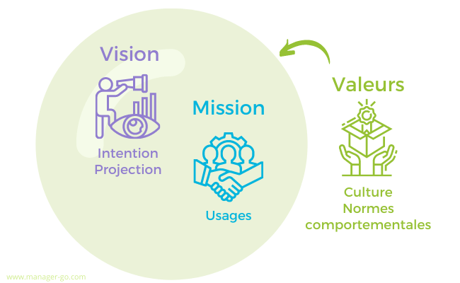
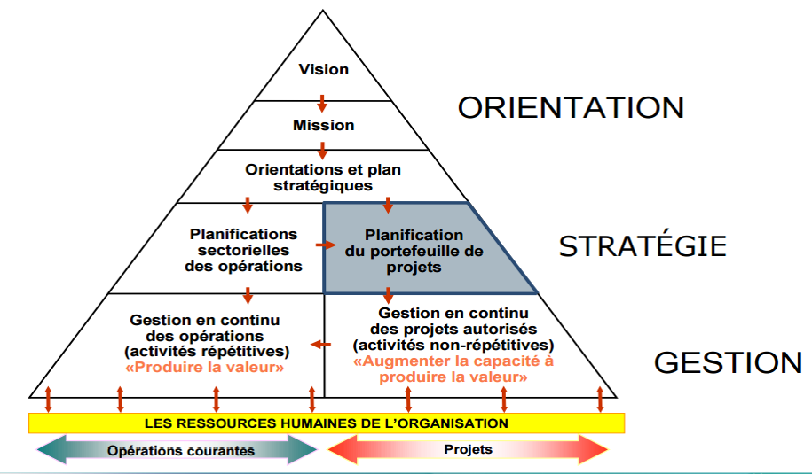

# Intégration de la Qualité dans la Stratégie à Long Terme

## Introduction

L'intégration de la qualité dans la stratégie à long terme est un aspect fondamental pour garantir la pérennité et la compétitivité d'une entreprise. Ce processus implique de veiller à ce que les pratiques de qualité soient étroitement alignées avec la vision et la mission de l'entreprise, et d'utiliser la qualité comme levier pour atteindre les objectifs stratégiques. Ce document explore comment réaliser cet alignement et comment la qualité peut devenir un moteur puissant de succès.

## 1. Alignement de la Qualité avec la Vision et la Mission de l'Entreprise

  
  

### 1.1 Vision et Mission de l'Entreprise

**Vision :** La vision d'une entreprise est une projection de ce qu'elle aspire à devenir à long terme. Elle définit une direction inspirante et un objectif global qui guide les actions futures.

**Mission :** La mission décrit la raison d'être de l'entreprise et son rôle dans le marché. Elle spécifie ce que l'entreprise fait, pour qui elle le fait, et comment elle se distingue de ses concurrents.

### 1.2 Importance de l'Alignement

L'alignement entre la qualité et la vision/mission de l'entreprise est crucial pour plusieurs raisons :

- **Création d'une culture de qualité :** En alignant les initiatives de qualité avec la vision et la mission, l'entreprise peut établir une culture organisationnelle où la qualité est perçue comme un élément central de la stratégie.
  
- **Optimisation des ressources :** L'alignement permet de diriger les efforts et les ressources vers des initiatives de qualité qui soutiennent directement les objectifs stratégiques, évitant ainsi le gaspillage et maximisant l'efficacité.

- **Renforcement de la marque :** Une forte orientation vers la qualité renforce la réputation de l'entreprise auprès des clients, des partenaires et des autres parties prenantes, contribuant à une image de marque positive.

### 1.3 Mise en Pratique

- **Définir des objectifs de qualité alignés :** Les objectifs de qualité doivent être spécifiquement conçus pour soutenir les ambitions stratégiques de l'entreprise. Par exemple, si la vision est de devenir le leader du marché en innovation, les objectifs de qualité pourraient se concentrer sur l'amélioration continue des processus et des produits.

- **Communiquer la vision et la mission :** Les principes de qualité doivent être intégrés dans les communications internes et externes pour s'assurer que tous les membres de l'organisation comprennent l'importance de la qualité dans la réalisation de la vision et de la mission.

- **Mesurer l'impact :** Utiliser des outils d'évaluation pour mesurer comment les initiatives de qualité contribuent à l'atteinte des objectifs stratégiques. Cela peut inclure des enquêtes de satisfaction client, des analyses de performance et des audits de qualité.

## 2. Planification Stratégique Axée sur la Qualité

  
  

### 2.1 Définition de la Planification Stratégique

La planification stratégique est le processus de définition des objectifs à long terme d'une entreprise et des actions nécessaires pour les atteindre. Lorsqu'elle est axée sur la qualité, elle intègre des considérations spécifiques concernant l'amélioration continue et la satisfaction des besoins des clients.

### 2.2 Éléments Clés de la Planification Stratégique Axée sur la Qualité

- **Analyse des besoins des parties prenantes :** Identifier les attentes et les exigences des clients, des employés et des autres parties prenantes. Cette analyse permet de concevoir des stratégies de qualité qui répondent aux besoins réels et contribuent à la satisfaction des parties prenantes.

- **Définition des priorités :** Établir quelles sont les priorités en matière de qualité en fonction de leur impact sur les objectifs stratégiques. Cela peut inclure l'amélioration des processus, la réduction des défauts, ou l'innovation dans les produits et services.

- **Établissement de KPI (Indicateurs Clés de Performance) :** Mettre en place des KPI pour suivre les progrès en matière de qualité. Les KPI peuvent inclure des mesures telles que le taux de défauts, la satisfaction client, et les coûts liés à la non-qualité.

### 2.3 Intégration dans le Plan Stratégique

- **Incorporer des objectifs de qualité spécifiques :** Les objectifs de qualité doivent être intégrés dans le plan stratégique global pour garantir que les efforts de qualité sont alignés avec les objectifs à long terme de l'entreprise.

- **Allouer les ressources nécessaires :** Assurer que les ressources financières, humaines et matérielles nécessaires à l'amélioration de la qualité sont disponibles. Cela peut inclure des investissements dans la formation, la technologie et les processus.

- **Surveiller et ajuster :** Mettre en place des mécanismes pour surveiller les performances en matière de qualité et ajuster les stratégies en fonction des résultats. Cela permet d'identifier rapidement les problèmes et d'adapter les actions en conséquence.

## 3. La Qualité comme Moteur de la Stratégie

  
  

### 3.1 Rôle de la Qualité dans la Stratégie

La qualité joue un rôle central dans la stratégie de l'entreprise en tant que moteur de :

- **Différenciation concurrentielle :** Une qualité supérieure permet de se démarquer sur le marché et de se positionner comme un leader. Les entreprises peuvent utiliser la qualité comme un avantage concurrentiel pour attirer et fidéliser les clients.

- **Satisfaction et fidélisation des clients :** Une gestion efficace de la qualité conduit à une meilleure satisfaction client, ce qui peut se traduire par une fidélisation accrue et des recommandations positives.

- **Efficacité opérationnelle :** La qualité contribue à l'amélioration des processus internes, réduisant les coûts liés aux défauts et aux erreurs, et augmentant l'efficacité opérationnelle.

### 3.2 Mise en Œuvre de la Qualité comme Moteur

- **Innovation continue :** Encourager une culture d'innovation pour améliorer constamment les produits, services et processus. L'innovation est essentielle pour maintenir la qualité à un niveau élevé et répondre aux évolutions du marché.

- **Engagement des leaders :** Les dirigeants doivent être des champions de la qualité, en soutenant les initiatives de qualité et en montrant l'exemple. Leur engagement est crucial pour instaurer une culture de qualité au sein de l'organisation.

- **Formation et développement :** Investir dans la formation des employés pour développer leurs compétences en gestion de la qualité. Une équipe bien formée est essentielle pour assurer que les pratiques de qualité sont correctement mises en œuvre et maintenues.

## Conclusion

L'intégration de la qualité dans la stratégie à long terme est essentielle pour aligner les efforts de qualité avec les objectifs stratégiques de l'entreprise. En mettant en œuvre des pratiques de qualité alignées avec la vision et la mission, en planifiant stratégiquement les initiatives de qualité et en utilisant la qualité comme un moteur de succès, les entreprises peuvent améliorer leur performance globale, renforcer leur position sur le marché et atteindre leurs objectifs à long terme. Une approche stratégique de la qualité permet non seulement de répondre aux attentes des parties prenantes mais aussi de créer une base solide pour une croissance durable et réussie.
