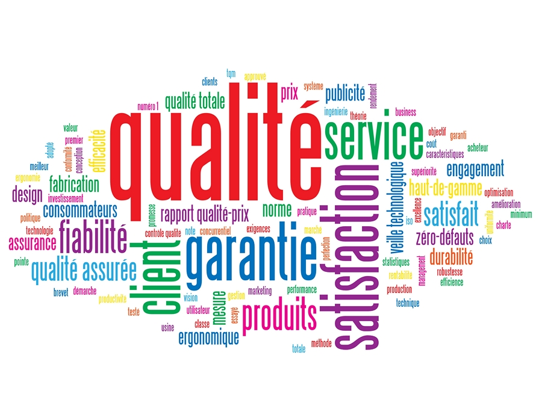

# Qualité et stratégie à long terme

**Hétic 2024**

  
  

## Plan du cours

- [Introduction](./00_introduction.md)
- [La Qualité comme Avantage Concurrentiel](./01_quality_as_advantage.md)
- [Outils et Technologies de la Gestion de la Qualité](./02_quality_management.md)
- [Intégration de la Qualité dans la Stratégie à Long Terme](./03_quality_integration.md)
- [Études de Cas : Entreprises Axées sur la Qualité](./04_cases_study.md)
- [Mesure de la Performance Qualitative](./05_quality_mesurement.md)
- [Défis et Opportunités de la Qualité à Long Terme](./06_quality_long_tyme_challenges.md)
- [Atelier : Élaboration d'une Stratégie à Long Terme Axée sur la Qualité](./07_atelier.md)
